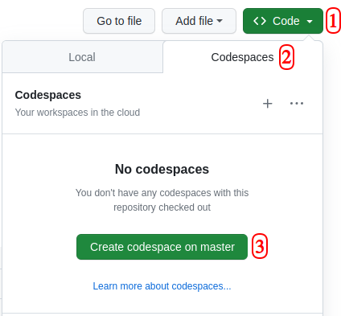

# Anjay Raspberry Pico W Client
## Overview
This repository contains a LwM2M Client application example for Raspberry Pico devices, based on the open-source [Anjay](https://github.com/AVSystem/Anjay) library and [Raspberry Pi Pico SDK](https://github.com/raspberrypi/pico-sdk).

## Examples

Example applications refer to [Anjay Basic Client Tutorial](https://avsystem.github.io/Anjay-doc/BasicClient.html) and can guide through the creation of a basic LwM2M Client based on Anjay library step by step.

Application|Description|Reference
---|---|---
[Anjay Initialization](anjay_init)|A minimum build environment for example client|[doc link](https://avsystem.github.io/Anjay-doc/BasicClient/BC-Initialization.html)
[Firmware Update](firmware_update)|Firmware Update object implementation. See [firmware update README](firmware_update/README.md) for more information|[doc link](https://avsystem.github.io/Anjay-doc/FirmwareUpdateTutorial.html)
[Mandatory Objects](mandatory_objects)|Mandatory LwM2M Objects necessary for setting up a connection with a server and an implementation of custom Anjay event loop|[doc link](https://avsystem.github.io/Anjay-doc/BasicClient/BC-MandatoryObjects.html)
[Secure Communication](secure_communication)|Secure communication using PSK mode<br>Note: randomness source does not meet requirements of security systems, see [comments in the code](secure_communication/main.c#L2)|[doc link](https://avsystem.github.io/Anjay-doc/BasicClient/BC-Security.html)
[Temperature Object with DS18B20](temperature_object_ds18b20)|Example Temperature Sensor object implementation using DS18B20|[doc link](https://avsystem.github.io/Anjay-doc/AdvancedTopics/AT-IpsoObjects.html)
[Temperature Object with MPL3115A2](temperature_object_mpl3115a2)|Example Temperature Sensor object implementation using Adafruit MPL3115A2|[doc link](https://avsystem.github.io/Anjay-doc/AdvancedTopics/AT-IpsoObjects.html)

## Compiling and launching

### Required tools

To compile and use the application, you will need some tools.

#### Ubuntu

```
sudo apt install python3 cmake minicom gcc-arm-none-eabi libnewlib-arm-none-eabi libstdc++-arm-none-eabi-newlib
```

#### macOS

```
brew install python3 cmake minicom armmbed/formulae/arm-none-eabi-gcc
```

#### Fedora

```
sudo dnf install python3 cmake minicom arm-none-eabi-newlib arm-none-eabi-gcc-cs-c++ arm-none-eabi-gcc-cs arm-none-eabi-binutils-cs gcc-arm-linux-gnu gcc-c++-arm-linux-gnu gcc gcc-c++
```

#### Windows
Download and install the following tools and programs:
 * [git for Windows](https://gitforwindows.org/) preferably with git Bash for unix-like shell and commands compatibility
 * [GNU Arm Embedded Toolchain](https://developer.arm.com/downloads/-/gnu-rm)
 * [MinGW](https://sourceforge.net/projects/mingw/) with `mingw32-base` and `mingw32-gcc-g++` packages
 * [CMake](https://cmake.org/download/)
 * [Python](https://www.python.org/downloads/windows/)

### Setting up the workspace

In order to successfully build the client, you need Raspberry Pi Pico SDK and FreeRTOS kernel cloned into a base directory, parallel to this repository. Creating a workspace from scratch could look like this:
```
mkdir pico
cd pico
git clone -b 1.4.0 https://github.com/raspberrypi/pico-sdk.git
cd pico-sdk/ 
git submodule update --init 
cd ..
git clone -b V10.5.0 https://github.com/FreeRTOS/FreeRTOS-Kernel.git
git clone https://github.com/AVSystem/Anjay-pico-client.git --recursive
```
Your final working tree should look like this:
```
$ ls -1
Anjay-pico-client
FreeRTOS-Kernel
pico-sdk
```

### Compiling

Go to the `Anjay-pico-client` repository and build the project with `<ssid>` and `<pass>` replaced with your WiFi name and password respectively. LwM2M Client Endpoint Name is also configured by `<endpoint_name>` parameter.
* **NOTE:** If you're using Windows, add `-G "MinGW Makefiles"` at the end of the first cmake command. It will help generate the proper files.
```
cd Anjay-pico-client
mkdir build
cd build
cmake -DCMAKE_BUILD_TYPE=Debug -DWIFI_SSID="<ssid>" -DWIFI_PASSWORD="<pass>" -DENDPOINT_NAME="<endpoint_name>" ..
cmake --build . -j
```

When building examples with security enabled (Secure Communication and Temperature Object), you need to provide PSK Identity and Key (by replacing `<identity>` and `<psk>` respectively with values entered in [Coiote LwM2M Server](#connecting-to-the-lwm2m-server)).
```
cmake -DCMAKE_BUILD_TYPE=Debug -DWIFI_SSID="<ssid>" -DWIFI_PASSWORD="<pass>" -DENDPOINT_NAME="<endpoint_name>" -DPSK_IDENTITY="<identity>" -DPSK_KEY="<psk>" .. 
cmake --build . -j
```

This should generate directories named after examples that contain, among others, files with `.uf2` and `.hex` extensions. `.uf2` files can be programmed through the bootloader and `.hex` are for programming using a debugger and SWD connection.

### GitHub Codespaces
A [Codespaces](https://docs.github.com/en/codespaces/overview) is a development
environment that's hosted in the cloud which allows you to work on your project
using a browser-based IDE on any computer. The repository is already set up to
be run on GitHub Codespaces. To run codespaces on this repository click the
`Create codespace on master` options.



The first startup usually takes a few
minutes during which the Docker container with the required dependencies is
installed (check the `.devcontainer/Docker` file). After the first system
initialization, the `.devcontainer/post_create.sh` script is run, which
installs the dependent repositories (section [Setting up the
workspace](#setting-up-the-workspace)).

Once the system is ready, we can proceed to build the project according to the
[Compiling](#compiling) section. We can download the resulting `.uf2` file to
our computer by right-clicking on it and selecting `Download`. Codespaces
images created by you are visible from the project space and from your GitHub
account (`Codespaces` tab). All changes you make while working on the code are
saved.

### Flashing
To program using the bootloader, press `BOOTSEL` button while connecting Raspberry Pi Pico W through a USB cable. It should be recognized then as a Mass Storage device, where you can copy the `.uf2` file, Pico will be programmed, reset and start running the code.

### Serial output
Serial port output is directed to the USB interface. Once a flashed Pico W board is connected to the computer, it should appear as `/dev/tty` (Unix) or as a `COM` (Windows) serial device. Logs can be seen by opening any serial communication program (e.g. `minicom` or `PuTTy`) and connecting to the device with baudrate 115200. On Unix system it can be done e.g. by executing
```
minicom -b 115200 -D /dev/ttyACM0
```
with `/dev/ttyACM0` used as an example, but set according to how the device is recognized and named in your setup.

## Connecting to the LwM2M Server
Pre-configured LwM2M Server to connect to is [Coiote IoT Device Management](https://www.avsystem.com/products/coiote-iot-device-management-platform/). Server URIs are set in project files (_`security_instance.server_uri`_  in `main.c`) as:
 * `coap://eu.iot.avsystem.cloud:5683` for NoSec mode,
 * `coaps://eu.iot.avsystem.cloud:5684` for secure communication.

To get access to the platform and add the device on the server side, please register at [https://eu.iot.avsystem.cloud/](https://eu.iot.avsystem.cloud/). There is a [guide showing basic usage of Coiote DM](https://iotdevzone.avsystem.com/docs/Coiote_IoT_DM/Quick_Start/Connect_device_quickstart/)
available on IoT Developer Zone. For the [Mandatory Objects](mandatory_objects) example that has no connection security enabled, simply select `NoSec` as `Security Mode` in the Guide step 3.

## Links
* [Anjay source repository](https://github.com/AVSystem/Anjay)
* [Anjay documentation](https://avsystem.github.io/Anjay-doc/index.html)
* [Doxygen-generated API documentation](https://avsystem.github.io/Anjay-doc/api/index.html)
* [AVSystem IoT Devzone](https://iotdevzone.avsystem.com/)
* [AVSystem Discord server](https://discord.avsystem.com)
* [Raspberry Pico Documentation](https://www.raspberrypi.com/documentation/microcontrollers/raspberry-pi-pico.html)
