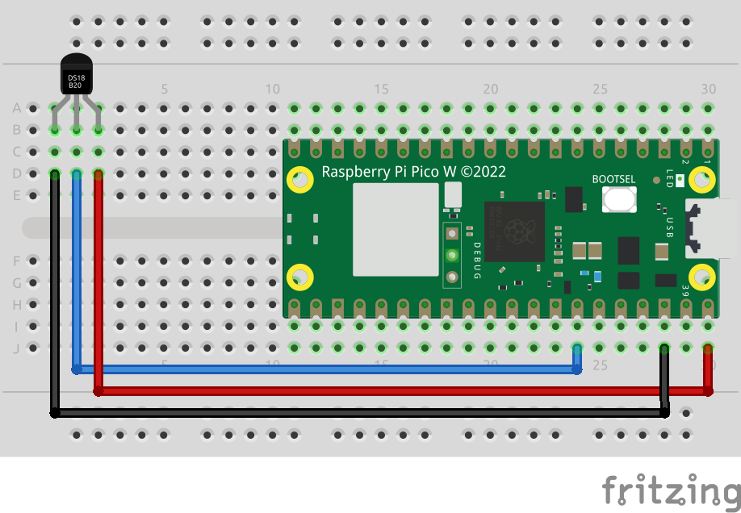

## Temperature Sensor Object

Anjay has a [dedicated API](https://avsystem.github.io/Anjay-doc/AdvancedTopics/AT-IpsoObjects.html) for reading data from sensors and reporting it to a LwM2M server. It provides an easy and convenient way to implement a sensor driver and start monitoring data through LwM2M. Temperature Sensor Object, as defined in [OMA LwM2M Object Registry](https://technical.openmobilealliance.org/OMNA/LwM2M/LwM2MRegistry.html) is a part of **IPSO Objects** group (listed in the Object Registry and explained in the Anjay API description above), so there is no need to implement it from scratch and write data model handlers.

The following example extends the [Secure Communication](../secure_communication) project with a low-level sensor driver and a higher-level IPSO object driver. Additionally, another task was created in `main.c` that reads data periodically and allows getting not only the momentary value but also tracking and recording the maximum and minimum readings from the sensor.

## Wiring information
| Raspberry Pi Pico W pin | DS18B20 pin |  
|---|---|
| 40 - VBUS | 1 - VCC |
| 38 - GND | 2 - GND |
| 34 - GPIO28 | 3 - data |

GPIO28 is the default pin for the data line, but it can be configured in `ds18b20.h` file.

The diagram includes a UART-USB converter that is not necessary for the system to work, but is handy for debugging.
