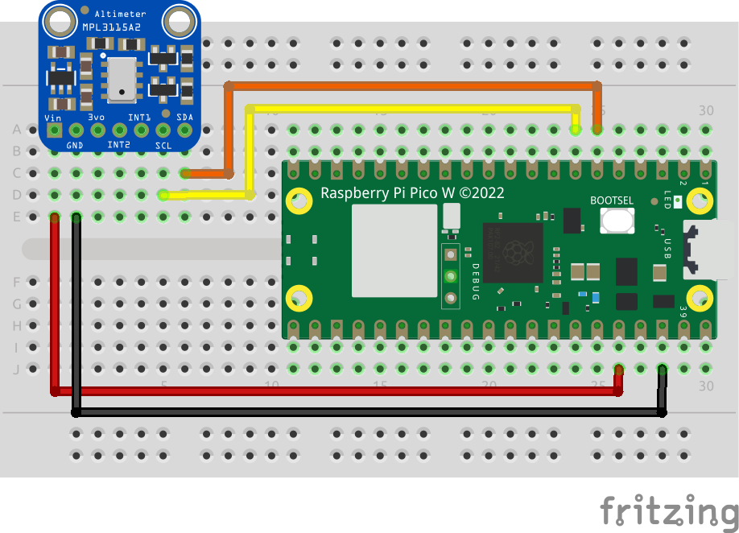

## Temperature Sensor Object

This project is based on an [example from Raspberry Pi Pico SDK Examples](https://github.com/raspberrypi/pico-examples/tree/master/i2c/mpl3115a2_i2c) repository. It uses the Adafruit MPL3115A2 Altimeter (with an embedded temperature sensor) connected via I2C according to the wiring diagram below.

Anjay has a [dedicated API](https://avsystem.github.io/Anjay-doc/AdvancedTopics/AT-IpsoObjects.html) for reading data from sensors and reporting it to a LwM2M server. It provides an easy and convenient way to implement a sensor driver and monitor sensors through LwM2M. Temperature Sensor Object, as defined in [OMA LwM2M Object Registry](https://technical.openmobilealliance.org/OMNA/LwM2M/LwM2MRegistry.html) is a so-called **IPSO Object** (listed in the Object Registry and explained in the Anjay API description above), so there is no need to implement it from scratch and write data model handlers.

The following example extends the [Secure Communication](../secure_communication) project with a low-level sensor driver and a higher-level IPSO object driver. Additionally, another task was created in `main.c` that reads data periodically and allows getting not only the momentary value but also tracking and recording the maximum and minimum readings from the sensor.

## Wiring information
| Raspberry Pi Pico W pin | Adafruit MPL3115A1 pin |
|---|---|
| 6 - GPIO4 | 7 - SDA |
| 7 - GPIO5 | 6 - SCL |
| 36 - VCC | 1 - Vin |
| 38 - GND | 2 - GND |

